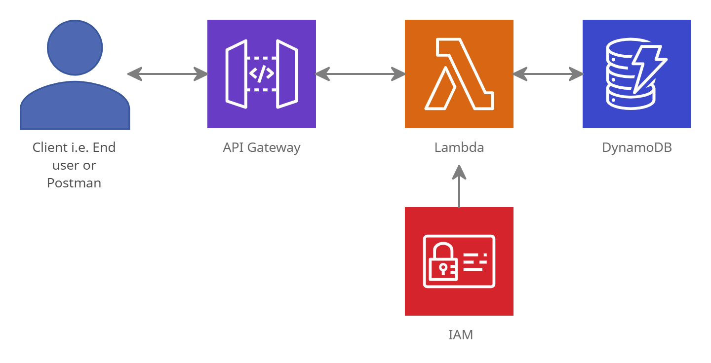

### Simple Serverless CRUD API using Node.js and AWS

### Services used 
- API Gateway 
- AWS Lambda 
- AWS DynamoDB 
- AWS Identity and Access Management (IAM)


### Functional Diagram 


### Using the Serverless Framework 
1. Install the serverless framework
```bash
$ npm install -g serverless 
$ sls -v
```

2. Create a new template 
```bash
$ sls create --template aws-nodejs --path <OUTPUT_FOLDER> 
```

3. Create Handlers in the `src/handlers.js` file for the serverless functions

4. Update the configuration in the `src/serverless.yml` file 

5. To deploy the functions
```bash
$ sls deploy 
```

6. To fetch logs for a specific function
```bash
$ sls logs -f <FUNCTION_NAME> -t
```

7. To invoke and test a function locally 
```bash
$ sls invoke local -f <FUNCTION_NAME> -p event.json
```